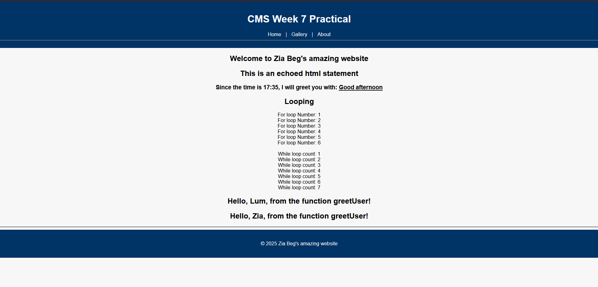
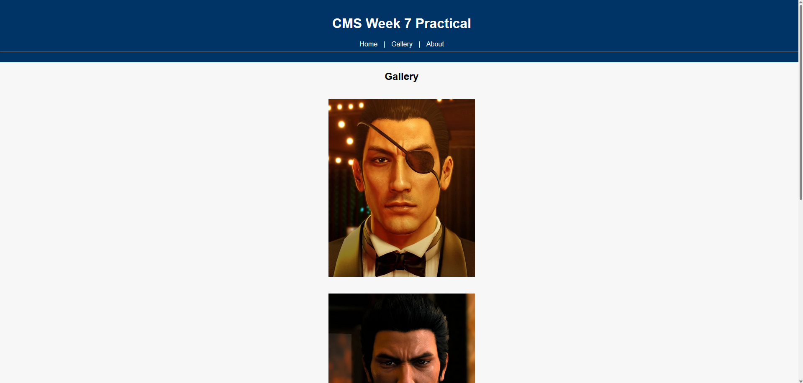
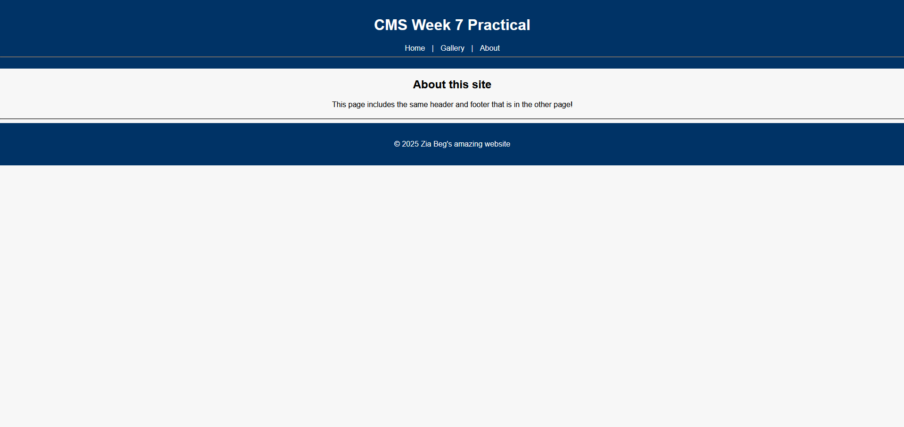

# CP3402 Weekly Practical Student Learning Journal Record
Student’s name: Zia Beg

ID: 14956832

## Week 7 - PHP Programming

### Learning Activities

In the seventh week of CMS, I spent most of my time learning about PHP programming. For assignment 1, since everything was easily done from the Wordpress and Joomla control panels, I rarely had to touch PHP and edit files directly. This meant, that I had to learn PHP coding from scratch. While it took some time to get set up with XAMPP on a new project, I quickly learnt that PHP is not that complicated. It has qualities of other languages, like variables, loops, conditional statements and functions, which made adapting to it quite easy.

As the practical was about showcasing knowledge of the basics of PHP, the content reflects just that. There are variables and conditional statements for getting the time and seeing whether it is morning, afternoon or evening, loops for looping through basic numbers and a function that takes in a name and prints a simple statement.

For assignment 2, the group and I got started on making the various pages for the website. We have delegated the tasks to each person to maximize efficiency.

---

### Resources/Links

Screenshots of the practicals site:

---

### Estimated Hours

Around 7 hours, where 4 hours were spent learning and applying PHP knowledge, 2 hours were spent making sites for the group project, and 1 hour was spent writing the journal. 

---

### Content Insights

Writing PHP code actually reminded me a bit of javascript, more specifically, using React with JS. It is nice to see the similarities, and it definitely helped me in getting used to PHP. Other than that, creating a simple site was not too complicated. I reused some of the images that I used in assignment 1 for the gallery page, as I did not want to spend too long finding ideas for the site.

---

### Career/Employability/Learning Insights

With PHP being one of the most widely used languages for server-side web development, I can definitely see the value in knowing it, and knowing whats happening behind the scenes of Wordpress and Joomla. I also believe that having an extra language in my arsenal will help me land jobs as well.