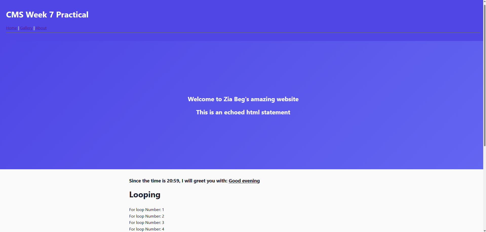
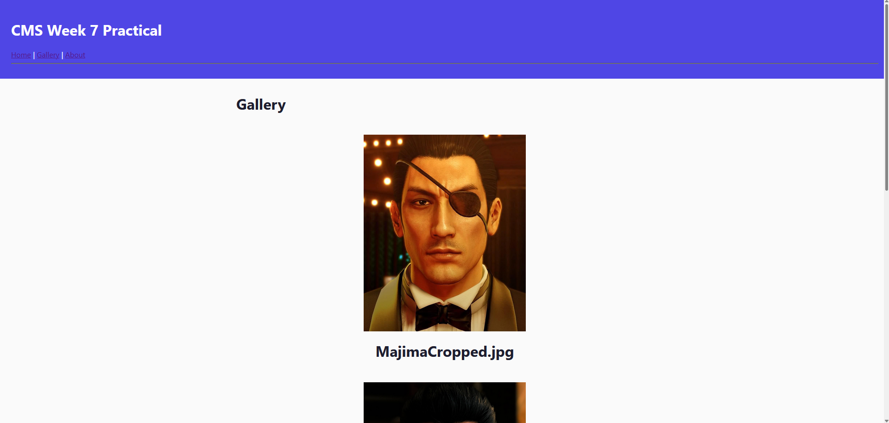
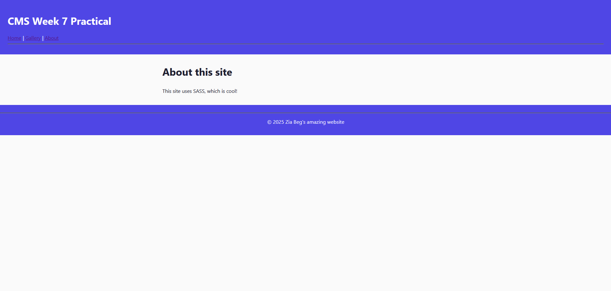

# CP3402 Weekly Practical Student Learning Journal Record
Student’s name: Zia Beg

ID: 14956832

## Week 9 - CSS pre-processing with Sass

### Learning Activities

In the ninth week of CMS, I spent most of my time preparing for the presentation, as well as recording for it. I had to move our website to AWS, rather than Spaceship, because it seemed more difficult to use Git version control, if not impossible, on Spaceship. By running it on an AWS EC2 instance instead, it allowed us to run Git commands, which allowed us to make changes locally and see them reflected on the live server. This made it more in line with the CI/CD workflow.

I also spent time on the practical, which involved creating a website with focus on using Syntactically Awesome Style Sheets (SASS). The content of the site is very simple, and has been re-used from the week 7 practical, as the content itself did not really matter. The interesting part was learning about SASS, and how it works and differs from regular CSS. 

---

### Resources/Links

Trello Link: [Link](https://trello.com/invite/b/690409ea046a38a985c8899e/ATTI058da19f08d9c5f8748833a57988bd603BEBABD5/team-trello)

Github Link: [Link](https://github.com/cp3402-students/project-2025-jcua-teama.git)

---

### Estimated Hours

Around 8 hours, where 4 were spent recording for the presentation, 2 were spent on the SASS tutorial, 1 was spent migrating to AWS, and 1 hour was spent writing the journal.

---

### Content Insights

Now that we have moved to AWS, instead of Spaceship, it allows us to use Git, as well as have greater control over the files. However, this does mean that we lose the domain name. 

As we had Spaceship as our hosting service for a while, I started seeing the value in using it rather than AWS. If we had the time and resources to get it set up properly for a CI/CD workflow, it would be quite good as we also would have been able to make use of the domain name.

---

### Career/Employability/Learning Insights

Learning to use SASS is important, as it allows for modularity in CSS code, which makes a lot of code reusable. I believe that this is important as it attracts a lot of companies, who are looking to keep their code clean and reusable.